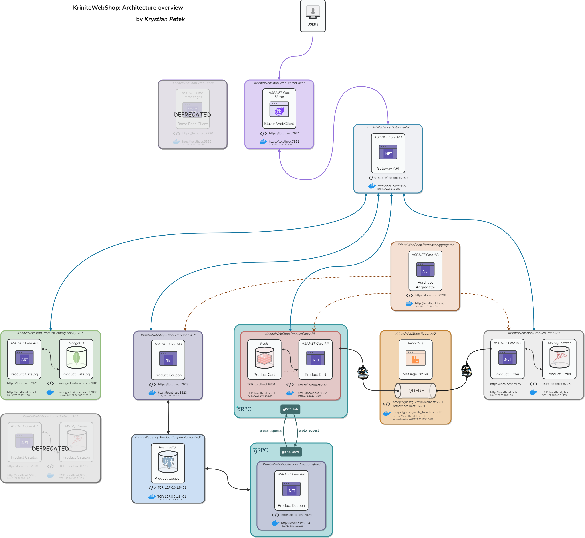

 
<h1 align="center">
  
</h1>

<h3 align="center">
 KriniteWebShop is a modern platform for online shopping in microservice architecture.
</h3>

**KriniteWebShop** is an e-commerce application build for selling of any products online. The application was created in the [C#](https://learn.microsoft.com/en-us/dotnet/csharp/) language using [ASP.NET Core](https://learn.microsoft.com/en-us/aspnet/core/?view=aspnetcore-7.0) framework, which allows you to create web apps and services that are fast, secure, cross-platform, and cloud-based. The visual side of the application was also made using the .NET platform, in the [ASP.NET Core Blazor](https://learn.microsoft.com/pl-pl/aspnet/core/blazor/?view=aspnetcore-7.0) framework. The application is designed for people who want to save time and money on shopping. The application allows users to visit the websites, registers and login (WIP) to the shop. They can check all the products available for shopping, filter and search item based on different categories, and then add to cart.

- The platform is developed using microservice architecture, which allows for scalability, reliability and easy maintenance of the system.
- The platform uses ASP.NET Core as the main technology for each microservices, which are hosted in Docker as containers and also in local environment.
- The platform offers a variety of features for both customers and sellers, such as product catalog, shopping cart, payment processing, order management, reviews and ratings, etc.

Application is splitted into 4 microservices, 1 web application and two additional microservices for API Gateway and Purchase Aggregator. Each microservice is a separate project in the solution. The microservices are:

- `KriniteWebShop.Cart` - microservice responsible for managing the shopping cart, which is used to store the products that the user wants to buy
- `KriniteWebShop.Catalog` - microservice responsible for managing the product catalog, which is used to store the products that the user can buy
- `KriniteWebShop.Coupon` - microservice responsible for managing the coupons and calculate discount, which is used to store the coupons that the user can use to get discount for the products in the cart
- `KriniteWebShop.Order` - microservice responsible for managing the orders, which is used to store the orders that the user made and to process the order checkout
- `KriniteWebShop.WebUI.Blazor` - web application responsible for managing the user interface, which is used to display the products, cart and order to the user, and also to allow the user to interact with the application
>
<!-- - `KriniteWebShop.Identity` - managing the identity -->
- `KriniteWebShop.PurchaseAggregator` - service which implements the [Gateway Aggregation](https://learn.microsoft.com/en-us/azure/architecture/patterns/gateway-aggregation) pattern and aggregates the data from the other microservices to ensure that the user can see the products in the cart and the total price of the order
- `KriniteWebShop.GatewayAPI` - service which implements the [Backend for Frontends](https://learn.microsoft.com/en-us/azure/architecture/patterns/backends-for-frontends) pattern and is responsible for routing the requests from the web application to the appropriate microservices
- `KriniteWebShop.Docker` - Visual Studio .sln project, which contains the Docker Compose files from each microservices, which allows to run the application in Docker containers by one click button

## Requirements

To start the application, you need to have the [Visual Studio 2022](https://visualstudio.microsoft.com/downloads/) installed on your computer and also [.NET 7.0 SDK](https://dotnet.microsoft.com/en-us/download) or later and [Docker Desktop](https://www.docker.com/products/docker-desktop/).

Then, depending on which microservices you want to run, you need other tools:

**KriniteWebShop.Cart** microservice requires:

- [Redis](https://redis.io/) - in-memory data structure store, used as a database, cached current cart and session data for each from users
- [RabbitMQ](https://www.rabbitmq.com/) - message broker, used to send messages for microservice KriniteWebShop.Order about new order checkout

**KriniteWebShop.Catalog** microservice requires:

- [MongoDB](https://www.mongodb.com/) - document-oriented database, used as a database, stored all products in the catalog

**KriniteWebShop.Coupon** microservice requires:

- [PostgreSQL](https://www.postgresql.org/) - relational database, used as a database, stored all current available coupons in the catalog

**KriniteWebShop.Order** microservice requires:

- [RabbitMQ](https://www.rabbitmq.com/) - message broker, used to receive messages from microservice KriniteWebShop.Cart about new order checkout
- [Microsoft SQL Server](https://www.microsoft.com/en-us/sql-server/sql-server-downloads) - relational database, used as a database, stored all orders in the catalog

## Usage

Each from microservices can be run in `docker` or in `local` environment. Depending on your runtime environment, the following steps are needed:

### Docker

To run the application in **`docker`**, you need to open the solution in Visual Studio and run the project **`KriniteWebShop.Docker`**. All microservices will be run in Docker containers, from the definition in `.dockerfile` from each microservices, all microservices and their dependencies will be downloaded from the `Docker Hub` and run in containers by `docker compose`.

### Local

To run the application in **`local`** environment, first you must run the `Cross Cutting Concerns` for project, which are `Redis`, `RabbitMQ`, `MongoDB`, `PostgreSQL` and `Microsoft SQL Server`. You can run only this services in `Docker`. To do it you need go for the path `assets\docker\local-environment` and invoke the `docker-compose up` command. All services will be run in Docker containers and then after start this services you can run the microservices in `local` environment. You need to open the solution in Visual Studio and define solution startup projects. To do it you need to right click on the solution and select `Properties` and then select `Multiple startup projects` and set the action for each microservices to `Start`. Then you can run the project:

- KriniteWebShop.Cart.API
- KriniteWebShop.Catalog.NoSQL.API
- KriniteWebShop.Coupon.gRPC
- KriniteWebShop.Order.API
- KriniteWebShop.GatewayAPI
- KriniteWebShop.PurchaseAggregator
- KriniteWebShop.WebUI.Blazor

## Project architecture

The project was created using the following technologies:

### Back-end

For each microservice, the following technologies were used:

- `ASP.NET Core` - framework for creating web applications, APIs and services
- `Swagger` - a tool for documenting and querying the API, which is used to test endpoints
- `Automapper` - library for mapping objects to other objects, used to map DTO models to domain entities
- `Swashbuckle` - library for integrating Swagger with ASP.NET Core

#### KriniteWebShop.Cart

- `Grpc.AspNetCore` - framework for implementing the gRPC protocol, which is used to consume Coupon **gRPC Service** for internal sync communication to calculate final price of products in cart
- `StackExchangeRedis` - library for connecting to the Redis database, which is used to publish CartCheckout event with using **MassTransit and RabbitMQ**
- `MassTransit` - library for implementing the message broker, which is used to send messages between microservices, this library ensure abstraction over RabbitMQ system

#### KriniteWebShop.Catalog

- `MongoDB` - library for connecting to the MongoDB database, which is used to store data in the form of documents

#### KriniteWebShop.Coupon

- `Npgsql` - library for connecting to the `PostgreSQL` database, which is used to store data in the form of tables
- `Dapper` - ORM for mapping objects to relational databases, in this case it is the PostgreSQL database, used to simplify data access and ensure high performance
- `Grpc.AspNetCore` - used to ensure high performance and expose the Coupon **gRPC Service** for internal sync communication with Cart microservice

#### KriniteWebShop.Order

- `Entity Framework Core` - ORM (Object Relational Mapper) to map objects to relational databases, with variants:
- `SqlServer` database, which is used to store data in a relational database Microsoft SQL Server
- `InMemory` database, which is used to store data in memory, for testing purposes
- `MailKit` - library for sending emails, which is used to send emails to users about the status of their order
- `MediatR` - library for implementing the CQRS pattern, which is used to separate the read and write sides of the application
- `FluentValidation` - library for model validation, checking the correctness of input data to the API with `IEndpointFilter` in middleware of ASP.NET Core

This microservice is developed with corresponding to the [Clean Architecture](https://blog.cleancoder.com/uncle-bob/2012/08/13/the-clean-architecture.html) and [CQRS](https://docs.microsoft.com/en-us/azure/architecture/patterns/cqrs) pattern and DDD (Domain Driven Design) approach. The project is divided into the following layers:

- `KriniteWebShop.Order.Domain` - domain layer, containing domain entities, specifically: `OrderEntity`, as well as public contracts to repositories of these entities, contracts to services domain names. This layer does not depend on any other layer, it has no external dependencies, it is the most inner layer.

- `KriniteWebShop.Order.Application` - warstwa aplikacji zawierająca logikę biznesową aplikacji, w tym przypadku są to funkcje aplikacji zgodne z wzorcem CQRS. Występują 2 rodzaje, commands and queries z ich walidatorami, handlerami oraz DTO modelami, które przekazują dane przez publiczny interfejs w `KriniteWebShop.Order.API`, a później w kolejnym etapie, przed wykonaniem operacji na bazie danych, są mapowane do encji domeny. Ta warstwa zależy od warstwy domeny, ale nie zależy już od żadnych warstw zewnętrznych. W tej warstwie znajdziemy również zachowania które są zaimplementowane przy pomocy wzorca dekorator, które są zarejestrowane jako PipelineBehavior dla MediatR.

- `KriniteWebShop.Order.Infrastructure` - the infrastructure layer, contains implementations of interfaces from the `KriniteWebShop.Order.Domain` layer, in this case these are repository implementations that use the `SQLServer` database with `Entity Framework Core`, as well as implementations of application services that use repositories. In this system, this layer contains implementations of repositories that are used in application services. This layer depends on the `KriniteWebShop.Order.Application`, it inherits from the domain layer because there is inheritance from the application layer. It is a layer that combines external dependencies with the domain layer, but using abstractions in the domain and application layer, the dependence of external entities from the project's business rules has been separated. The infrastructure layer is mainly used to communicate external dependencies not directly related to the project's business theme, such as a database, file system or external API.

- `KriniteWebShop.Order.API` - API layer, contains controllers that are responsible for handling HTTP requests that are sent to the API. This layer also contains the Swagger configuration, which is used to document the API and to test endpoints. This layer depends on the application layer by inheriting from the infrastructure layer, because it uses application services that are used in controllers. This layer is the outermost layer, because it is the layer that is visible to the end users of the system, because it is here that endpoints are issued that are used by client applications to communicate with the API. This layer is directly dependent only on the infrastructure layer. A global error handling system has also been implemented here, which is used in controllers to return appropriate HTTP error codes, depending on what error occurred in the system, and to ensure that the application is not stopped by an unhandled exception.

#### KriniteWebShop.GatewayAPI

- `Ocelot` - library for implementing the API Gateway pattern, which is used to route requests from the web application to the appropriate microservices

This microservice is developed using the [Backend for Frontends](https://learn.microsoft.com/en-us/azure/architecture/patterns/backends-for-frontends) pattern and is responsible for routing the requests from the web application to the appropriate microservices.

### Front-end

#### KriniteWebShop.WebUI.Blazor

- `ASP.NET Core Blazor` - framework for creating web applications using C# and HTML, CSS and JavaScript
- `Bootstrap` - library for creating responsive web applications, which is used to create the visual side of the application

## Features

The application offers the following features:

#### Catalog

- `GetCart` - get the cart of the user
- `CartCheckout` - checkout the cart of the user
- `UpdateCart` - update the cart of the user, add new items
- `DeleteCart` - remove the cart of the user

#### Cart

- `GetProductById` - get the product by id
- `GetProductsByName` - get the products by name
- `GetProductsByCategory` - get the products by category
- `CreateProduct` - create the product
- `UpdateProduct` - update the product
- `DeleteProduct` - delete the product
- `GetProductsCategories` - get the products categories

#### Coupon

- `GetCoupon` - get the coupon for product by product name
- `CreateCoupon` - create coupon for product
- `UpdateCoupon` - update coupon for product
- `DeleteCoupon` - delete coupon for product

#### Order

- `GetOrdersByUserName` - get the orders by user name
- `CheckoutOrder` - checkout the order
- `UpdateOrder` - update the order
- `DeleteOrder` - delete the order

## Screenshots

<!-- | | | |
| :-------------------------:|:-------------------------:|:-------------------------: |
|   |   |  | -->

<!-- 5. You can **launch microservices** as below urls: -->

<!-- - logo -->
<!-- - title -->
<!-- - description -->
<!-- - requirements -->
<!-- - usage -->
<!-- - architektura -->
<!-- - technologies (Build with) -->
<!-- - features -->
<!-- - TOC - table of contents
- folder structure ??
- app screenshots
- API (table of api endpoints - swagger) -->
